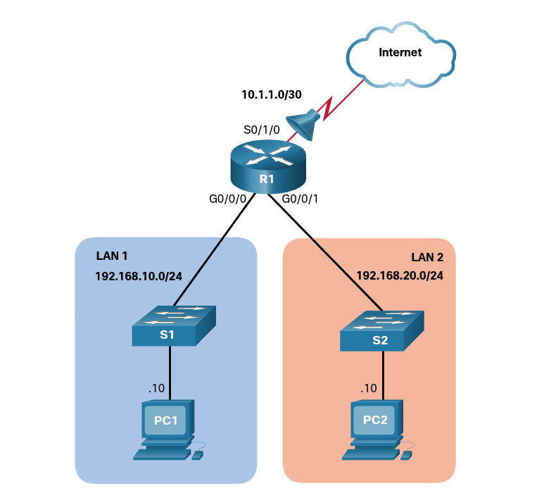

# Hardware a Sítě (Jakubec)

## 1. Hodina 2021-09-03

### Seznámení s plánem učiva

## 2. Hodina 2021-09-07

### Opakování 3. ročníku

* Je dobré mít dokumentaci sítě
	* Číslovací schéma IP adres
* Nastavení IP adres portů na routeru
`/home/czechball/packettracer/saves/hs-demo.pkt`

## 3. Hodina 2021-09-10

### OSPF (Open Shortest Path First)

#### Funkce a vlastnosti

* OSPFv2 se používá pro IPv4, OSPFv3 se používá pro IPv6
* OSPF vyhodnocuje nejrychlejší spoj v síti a optimalizuje provoz
* Jedná se o **link-state routing protokol**
* Alternativa zastaralého protokolu RIP
* Využití algoritmu SPF, SPF tree, vytvoření routovacích pravidel

#### OSPF Pakety

* Hello packets
* Database description packets
* Link-state request packets
* Link-state update packets
* Link-state acknowledgements packets

#### Data struktura

* Adjacency database (neighbor table)
* Link-state database (LSDB) - topology
* Forwarding database (routing table)

#### Link-State Operation

Pořadí akcí:

1. Navázání "Neighbor Adjacencies"
	* Detekce ostatních OSPF routerů
	* Odeslání *Hello* packetů
	* Navázání "sousednosti" (adjacency)
2. Výměna Link-State "Advertisements"
	* Výměna LSAs (link-state advertisements)
	* LSA obsahuje informace o "ceně" (cost) a stav linku
	* Routery "zaplavují" (flood) svoje LSAs sousedům
3. Sestavení tabulky (databáze) s Link-State informacemi
	* Po příjmu LSAs sestaví routery topology table
4. Spuštění SPF algoritmu
	* SPF vytvoří "SPF Tree"
5. Vybrání nejlepší cesty (routy)
	* Počítání ceny

#### Single a Multi Area OSPF

* Single-Area OSPF - všechny routery jsou v jedné oblasti, je dobré označit ji číslem 0
* Multi-Area OSPF - OSPF používá více oblastí, všechny musí být napojené na "backbone area". Routery které se tam napojují se jmenují Area Border Routers (ABRs)

## 4. Hodina 2021-09-14

### Typy OSPF paketů

|Typ|Název Paketu|Popis|
|---|---|---|
|1|Hello|Detekce sousedů a navázání "sousedství" (adjacency)|
|2|Database Description **(DBD)**|Konroluje synchronizaci databází mezi routery|
|3|Link-State Request **(LSR)**|Výměna specifických link-state informací mezi routery|
|4|Link-State Update **(LSU)**|Pošle specificky vyžádané link-state informace|
|5|Link-State Acknowledgment **(LSAck)**|Potvrzuje přijetí ostatních typů paketů|

* Typ 4 (LSU) může být odeslán bez vyžádání

#### Link-State Updates (LSU)

* Routery si na začátku pošlou pakety typu 2 (DBD), což je zkrácený seznam LSDB zdrojového routeru. Je to použito příjemcem ke kontole lokální LSDB
* Paket typu 3 (LSR) je používaný příjemcem k vyžádání více informací o záznamu v DBD
* Paket typu 4 (LSU) se používá jako odpověď na paket typu 3 (LSR)
* Paket typu 5 (LSack) se používá k potvrzení příjmu paketu typu 4 (LSU)

### Hello Packet

* Objevují sousedy a navazují adjacencies
* Propagují parametry na základě kterých se dva routery stanou sousedy
* Nastaví routery jako Designated Router **(DR)** a Backup Designated Router **(BDR)** v multiaccess sítích (Ethernet) (P2P nevyžaduje multiaccess)

## 5. Hodina 2021-10-01

### Konfigurace OSPF routerů
* Router ID - 32 bitová hodnota, zapsaná jako IPv4 adresa
* Pokud není přiřazena ručně, generuje se automaticky

Možnosti konfigurace OSPF ID
1. Router ID je explicitně nastavené pomocí router-id příkazu
2. Router ID není explicitně nastaveno, router použije nejvyšší IPv4 adresu jakéhokoliv loopback rozhraní
3. Pokud neexistují loopback zařízení, router si vybere nejvyšší IPv4 adresu jakéhokoliv fyzického rozhraní

## 6. Hodina 2021-10-05

### Maska sítě u OSPF ID

* Spočítání wildcard masky: `255.255.255.255 - subnet`
	* Např.: `255.255.255.255 - 255.255.255.192 (subnet /26 sítě) = 0.0.0.63 (wildcard maska)`

### Konfigurace sítě pro OSPF ID

Jsou dvě možnosti:

#### Použití příkazu *network*
```
R1(config)# router ospf 10
R1(config-router)# network 10.10.1.0 0.0.0.255 area 0
R1(config-router)# network 10.1.1.4 0.0.0.3 area 0
R1(config-router)# network 10.1.1.12 0.0.0.3 area 0
R1(config-router)#
```

#### Použití příkazu *ip ospf*
* Template
```
Router(config-if)# ip ospf process-id area area-id
```
* Příklad
```
R1(config)# router ospf 10
R1(config-router)# no network 10.10.1.1 0.0.0.0 area 0
R1(config-router)# no network 10.1.1.5 0.0.0.0 area 0
R1(config-router)# no network 10.1.1.14 0.0.0.0 area 0
R1(config-router)# interface GigabitEthernet 0/0/0
R1(config-if)# ip ospf 10 area 0
R1(config-if)# interface GigabitEthernet 0/0/1 
R1(config-if)# ip ospf 10 area 0
R1(config-if)# interface Loopback 0
R1(config-if)# ip ospf 10 area 0
R1(config-if)#
```
```
interface lo0		# přepnutí do rozhraní
ip ospf 10 area 0	# asociace rozhraní
interface g0/0/0
ip ospf 10 area 0
interface g0/0/1
ip ospf 10 area 0
```

### Pasivní rozhraní
* Není potřeba posílat OSPF pakety na všechna dostupná rozhraní, stačí je poslat pouze na rozhraní na OSPF routerech
* Nepřítomnost OSPF rozhraní může způsobit zbytečné rozesílání hello packetů
* Může způsobit:
	* Zahlcení sítě
	* Zahlcení zařízení
	* Bezpečnostní riziko - OSPF pakety mohou být zachyceny, upraveny a poslány zpět

#### Konfigurace pasivního rozhraní
* Příkaz `passive-interface` (konfigurační režim)
* Zabrání posílání routovacích zpráv na daném rozhraní, ale stále mu umožní propagaci ostatním routerům
* Příklad konfigurace R1 loopback 0/0/0 rozhraní jako pasivní
```
R1(config)# router ospf 10
R1(config-router)# passive-interface loopback 0
R1(config-router)# end
R1#
*May 23 20:24:39.309: %SYS-5-CONFIG_I: Configured from console by console
R1# show ip protocols
*** IP Routing is NSF aware ***
(output omitted)
Routing Protocol is "ospf 10"
  Outgoing update filter list for all interfaces is not set
  Incoming update filter list for all interfaces is not set
  Router ID 1.1.1.1
  Number of areas in this router is 1. 1 normal 0 stub 0 nssa
  Maximum path: 4
  Routing for Networks:
  Routing on Interfaces Configured Explicitly (Area 0):
    Loopback0
    GigabitEthernet0/0/1
    GigabitEthernet0/0/0
  Passive Interface(s):
    Loopback0
  Routing Information Sources:
    Gateway         Distance      Last Update
    3.3.3.3              110      01:01:48
    2.2.2.2              110      01:01:38
  Distance: (default is 110)
R1#
```

### OSPF v Point to Point sítích
* Cisco routery ve výchozím nastavení vyberou DR a BDR rozhraní v Ethernet rozhraních, i když se v linku nachází pouze jedno zařízení. Toto se dá ověřit příkazem `show ip ospf interface`
```
R1# show ip ospf interface GigabitEthernet 0/0/0
GigabitEthernet0/0/0 is up, line protocol is up 
  Internet Address 10.1.1.5/30, Area 0, Attached via Interface Enable
  Process ID 10, Router ID 1.1.1.1, Network Type BROADCAST, Cost: 1
  Topology-MTID    Cost    Disabled    Shutdown      Topology Name
        0           1         no          no            Base
  Enabled by interface config, including secondary ip addresses
  Transmit Delay is 1 sec, State BDR, Priority 1
  Designated Router (ID) 2.2.2.2, Interface address 10.1.1.6
  Backup Designated router (ID) 1.1.1.1, Interface address 10.1.1.5
  Timer intervals configured, Hello 10, Dead 40, Wait 40, Retransmit 5
    oob-resync timeout 40
    Hello due in 00:00:08
  Supports Link-local Signaling (LLS)
  Cisco NSF helper support enabled
  IETF NSF helper support enabled
  Index 1/2/2, flood queue length 0
  Next 0x0(0)/0x0(0)/0x0(0)
  Last flood scan length is 1, maximum is 1
  Last flood scan time is 0 msec, maximum is 0 msec
  Neighbor Count is 1, Adjacent neighbor count is 1 
    Adjacent with neighbor 2.2.2.2  (Designated Router)
  Suppress hello for 0 neighbor(s)
R1#
``` 
* Pokud se na síti nachází pouze dva routery, může se povolit point-to-point pro "ušetření" výkonu
* Proces výběru DR/BDR je zbytečný
* Point to Point se povolí příkazem `ip ospf network point-to-point`
```
R1(config)# interface GigabitEthernet 0/0/0
R1(config-if)# ip ospf network point-to-point
*Jun  6 00:44:05.208: %OSPF-5-ADJCHG: Process 10, Nbr 2.2.2.2 on GigabitEthernet0/0/0 from FULL to DOWN, Neighbor Down: Interface down or detached
*Jun  6 00:44:05.211: %OSPF-5-ADJCHG: Process 10, Nbr 2.2.2.2 on GigabitEthernet0/0/0 from LOADING to FULL, Loading Done
R1(config-if)# interface GigabitEthernet 0/0/1
R1(config-if)# ip ospf network point-to-point 
*Jun  6 00:44:45.532: %OSPF-5-ADJCHG: Process 10, Nbr 3.3.3.3 on GigabitEthernet0/0/1 from FULL to DOWN, Neighbor Down: Interface down or detached
*Jun  6 00:44:45.535: %OSPF-5-ADJCHG: Process 10, Nbr 3.3.3.3 on GigabitEthernet0/0/1 from LOADING to FULL, Loading Done
R1(config-if)# end
R1# show ip ospf interface GigabitEthernet 0/0/0
GigabitEthernet0/0/0 is up, line protocol is up 
  Internet Address 10.1.1.5/30, Area 0, Attached via Interface Enable
  Process ID 10, Router ID 1.1.1.1, Network Type POINT_TO_POINT, Cost: 1
  Topology-MTID    Cost    Disabled    Shutdown      Topology Name
        0           1         no          no            Base
  Enabled by interface config, including secondary ip addresses
  Transmit Delay is 1 sec, State POINT_TO_POINT
  Timer intervals configured, Hello 10, Dead 40, Wait 40, Retransmit 5
    oob-resync timeout 40
    Hello due in 00:00:04
  Supports Link-local Signaling (LLS)
  Cisco NSF helper support enabled
  IETF NSF helper support enabled
  Index 1/2/2, flood queue length 0
  Next 0x0(0)/0x0(0)/0x0(0)
  Last flood scan length is 1, maximum is 2
  Last flood scan time is 0 msec, maximum is 1 msec
  Neighbor Count is 1, Adjacent neighbor count is 1 
    Adjacent with neighbor 2.2.2.2
  Suppress hello for 0 neighbor(s)
R1#
```

**Pozn.: *ip ospf network point-to-point* nefunguje na Gigabit ethernetech v Packet Traceru**

## 7. Hodina 2021-10-12

### OSPF - Opakování

## 8. Hodina 2021-10-15

### Ověření funkčnosti Single-Area OSPFv2 (Packet Tracer)

### Kyberbezpečnost

#### Přehled výuky
* Momentální stav
* Threat actors
* Malware
* Běžné útoky
* TCP a UDP zranitelnosti
* IP Services
* Best Practices  

**Ethical Hacking**
* Otázka morality
* Otázka legality

### Pojmy
|Název|popis|
|---|---|
|Assets|An asset is anything of value to the organization. It includes people, equipment, resources, and data.|
|Vulnerability|A vulnerability is a weakness in a system, or its design, that could be exploited by a threat.|
|Threat|A threat is a potential danger to a company’s assets, data, or network functionality.|
|Exploit|An exploit is a mechanism that takes advantage of a vulnerability.|
|Mitigation|Mitigation is the counter-measure that reduces the likelihood or severity of a potential threat or risk. Network security involves multiple mitigation techniques.|
|Risk|Risk is the likelihood of a threat to exploit the vulnerability of an asset, with the aim of negatively affecting an organization. Risk is measured using the probability of the occurrence of an event and its consequences.
|
### Vektory útoků
* Externí a interní

## 9. Hodina 2021-10-22

### Malware
* Adware
* Ransomware
* Rootkit
* Spyware
* Worm

#### Typy virů
* Vir v boot sektoru
* Vir ve firmwaru
* Makro virus (MS Office)
* Virus v programu
* Virus ve skriptu

### Typy útoků
* Útoky na přístupové údaje (password attacks)
* Spoofing
* Denial of Service (případně distributed)
* Recon útoky (reconnaissance), zjišťování informací o cíli
  * Vyhledávání veřejných informací
  * Interní nebo externí sken sítě, např. nmap

## 9. Hodina 2021-11-02

### Opakování - typy útoků, social engineering útoky

#### Typy social engineering útoků
* Pretexting
* Phishing
* Spear phishing
* Spam
* SfS (something for something)
* Baiting
* Impersonating
* Tailgating
* Shoulder surfing
* Dumpster diving

### IP Útoky

#### Typy IP útoků
* ICMP
  * Útočníci používají různé zprávy:
  
  |ICMP Zpráva|Účel|
  |---|---|
  |echo request a reply|Používá se k ověření existence cíle a DoS útoku|
  |unreachable|Skenování sítě, recon|
  |mask reply|Skenování interní sítě|
  |redirects|Přesměrování provozu sítě přes kompromitované zařízení, počátek MITM útoki|
  |router discovery|Vkládání falešných záznamů do routovací tabulky cíle|
* Spoofování adres
  * Manuální nastavení MAC adresy vlastního zařízení za účelem obcházení MAC whitelistu/blacklistu
* MITM
* Session hijack

## 10. Hodina 2021-11-09

### Network security best practices

#### CIA triad

1. Confidentiality
2. Integrity
3. Availability

#### Zařízení poskytující bezpečnost

* VPN
* ASA Firewall (Cisco firewall, stateful)
* IPS (Intrusion Prevention System)
* ESA/WSA (Email/Web Security Appliance)
* AAA Server (např. Radius)

### Firewally

* Důležité pro bezpečnost sítě
* Vynucují pravidla sítě a externího přístupu

## 11. Hodina 2021-11-12

### Kryptografie

* Hashování
* Šifrování dat

## 12. Hodina 2021-11-16

### Network Security Concepts - ACLs

#### ACLs na Cisco routerech

* Příklady aplikace

|Úkol|Příklad|
|---|---|
|Omezování provozu pro lepší výkon sítě|Omezení video provozu, blokování video provozu|
|Kontrolování toku provozu|Limitování provozu jen na určité odkazy|
|Základní bezpečnost sítě|Přístup k HR síti pouze pro autorizované uživatele|
|Monitorování zařízení za účelem povolení či zákazu přístupu k síťovým službám|Přístup k daným typům (ftp..) povolen pouze určitým skupinám uživatelům|
|Přidání priority konkrétním síťovým aktivitám|QoS - např. hlasové služby budou mít vyšší prioritu aby hovory neměly zpoždění|

#### Filtrování paketů

* Typy filtrování (podle IP, obsahu...)
* IP filtrování
  1. Router extrahuje zdrojovou IPv4 z hlavičky paketu
  2. Router začne od shora ACL a porovnává danou IPv4 s každým ACE (ACL Statements)
  3. Pokud je nalezena shoda, router provede instrukci, buďto povolí nebo zakáže komunikaci
  4. Pokud není nalezena žádná shoda, router adresu nepustí, protože automaticky je povolené pravidlo zahazování všech neznámých

## 13. Hodina 2021-11-23

### Vytváření ACL

* Deny, Permit pravidla

#### Syntax pro standardní číslovaná IPv4 ACL

* `Router(config)# access-list access-list-number {deny | permit | remark text} source [source-wildcard] [log]`

|Parametr|Popis|
|---|---|
|*access-list-number*|Číslo ACL, 1-99 nebo 1300-1999|
|**deny**|Zakáže přístup
|**permit**|Povolí přístup
|remark *text*|Poznámka, nepovinné
|*source*|Identifikuje zdrojovou síť nebo hosta pro filtrování, může být **any** pro všechny sítě, "**host** *ip-address*" nebo jen *ip-address*|
|*source-wildcard*|Wildcard maska pro zdroj, nepovinné|
|**log**|Logování pro ACL, nepovinné|

* Odstranění ACL: `no access-list access-list-number`

#### Syntax pro standardní pojmenovaná IPv4 ACL

* `Router(config)# ip access-list standard access-list-name`
* Odstranění ACL: `no ip access-list standard access-list-name`
* Jména jsou alfanumerická, case sensitive a musí být unikátní
* Kapitalizace není povinná ale je doporučená

#### Aplikování standardního IPv4 ACL

* `Router(config-if) # ip access-group {access-list-number | access-list-name} {in | out}`

#### Odstranění standardního IPv4 ACL z interface

* `no ip access-group`

### Příklady číslovaného IPv4 ACL



* Pouze PC1 může na internet

```
R1(config)# access-list 10 remark ACE permits ONLY host 192.168.10.10 to the internet
R1(config)# access-list 10 permit host 192.168.10.10
R1(config)# do show access-lists
Standard IP access list 10
    10 permit 192.168.10.10
R1(config)#
```

* Všichni hosti na LAN 2 také můžou na internet
  * Přidání `20 permit 192.168.20.0, wildcard bits 0.0.0.255`

```
R1(config)# access-list 10 remark ACE permits all host in LAN 2
R1(config)# access-list 10 permit 192.168.20.0 0.0.0.255
R1(config)# do show access-lists
Standard IP access list 10
    10 permit 192.168.10.10
    20 permit 192.168.20.0, wildcard bits 0.0.0.255
R1(config)#
```

#### Zobrazení ACL

* `show run | section access-list`
* Ověření ACL na rozhraní: `show ip int <interface> | include access list`

### Příklady pojmenovaného ACL

* Odebrání číslovaného ACL z předchozího příkladu
  * `R1(config)# no access-list 10`
* Vytvoření pojmenovaného ACL

```
R1(config)# ip access-list standard PERMIT-ACCESS
R1(config-std-nacl)# remark ACE permits host 192.168.10.10
R1(config-std-nacl)# permit host 192.168.10.10
```

### Úprava ACL

#### Metoda textového editoru

* Nejdřív zobrazení existujících: `show run | section access-list`
* Poté zkopírujeme obsah, přepíšeme co potřebujeme v text editoru a vytvoříme ACL znovu

### Statistiky

* Reset: `clear access-list counters NO-ACCESS`

## 14. Hodina 2021-11-30

### Charakteristiky NAT

#### Privátní IPv4 rozsahy

|Třída|Rozsah|Prefix|
|---|---|---|
|A|10.0.0.0 - 10.255.255.255|10.0.0.0/8|
|B|172.16.0.0 - 172.31.255.255|172.16.0.0/12|
|C|192.168.0.0 - 192.168.255.255|192.168.0.0/16|

* NAT překlad

## 15. Hodina 2021-12-03

### NAT pro IPv4 - Druhy NATů

* Statický NAT
* Dynamický NAT

#### Statický NAT

* 1 inside local = 1 inside global

#### Dynamický NAT

* first come, first serve

## 16. Hodina 2021-12-07

### Statický NAT

* Packet - Cesta z Inside Local na Outside Local, poté z Inside Global na Outside Global
* Inside a Outside Global jsou často stejné adresy

### Scénář statického NATu

## 17. Hodina 2021-12-17

### LAN/WAN opakování

## 18. Hodina 2022-01-11

### Tradiční možnosti připojení k WAN

* Z počátku použití "analogového" přenosu na starších ústřednách
  * Sériová / paralelní komunikace
* Přechod na komunikaci pomocí paketů

## 19. Hodina 2022-01-18

### Možnosti připojení k internetu

* Metro Ethernet (metropolitní síť)

\<A\> --- (X)\[WAN\](X) --- \<B\>

* Zákazníci A, B připojeni k síti WAN
* K síti WAN připojen i internet
* MPLS (Multiprotocol Label Switching)

### Internetové připojení

||Internet-Based||
|---|---|---|
||Broadband VPN||
|**Wired**||**Wireless**|
|xDSL||Municipal Wi-Fi|
|Cable||Cellular|
|Optical Fiber||Satellite Internet|
|||WiMax|

#### DSL

* Technologie DSL (Digital Subscriber Line)
* Analogová komunikace poslední míle přes telefonní linku
* ADSL (Asymetric) - upstream na 26\~138 KHz, downstream 138~1100 KHz
  * Upředňostňován download před uploadem, asymetrické připojení
* Schéma
  * Domov > DSL Modem > Telefonní linka > DSLAM (DSL Access Multiplexer) > PSTN / Internet
* PPP Protokol - Point-To-Point pro DSL, možnost autentizace, přidělení IPv4 atd

#### Kabelové Připojení

* DOCSIS (Data Over Cable Service Interface Specification)

#### Optické Vlákno

* Fiber to Home (FTTH)
* Fiber to the Building (FTTB)
* Fiber to the Node/Neighbourhood (FTTN)

#### Cellular Připojení

#### Satelitní Připojení

#### WiMAX

## 20. Hodina 2022-02-11

### Implementace QoS

#### Tři fáze

* Klasifikace
  * Klasifikace paketů
  * Označování
* Zabránění zahlcení
  * Některý provoz může být dropped
* Správa zahlcení
  * Pokud provoz přesáhne dostupné prostředky, provoz se bude řadit

#### Označování provozu (klasifikace)

|QoS Tools|Layer|Marking Field|Width in Bits|
|---|---|---|---|
|Ethernet|2|Class of Service (CoS)|3|
|Wi-Fi|2|Wi-Fi Traffic Identifier (TID)|3|
|MPLS|2|Experimental (EXP)|3|
|IPv4 a IPv6|3|IP Precedence|3|
|IPv4 a IPv6|3|Differentiated Services Code Point (DSCP)|6|

#### Zabránění zahlcení

|<!-- -->|<!-- -->|
|--|--|
|Plná řada|Plné zahazování paketů|
|Maximální práh|Zahození procenta|
|Minimální práh||
|Prázdná řada|Žádné zahazování|

#### QoS Ethernet Hodnoty

|Hodnota|Popis|
|---|---|
|7|Rezervována|
|6|Rezervována|
|5|Voice Bearer|
|4|Videoconferencing|
|3|Call Signaling|
|2|High-Priority Data|
|1|Medium-Priority Data|
|0|Best-Effort Data|

#### DSCP Hodnoty

* Best-Effort (BE) - výchozí pro všechny IP pakety. Výchozí hodnota je 0
* Expedited Forwarding (EF) - doporučeno pouze pro nejdůležitější provoz, zejména hlasový
* Assured Forwarding (AF)

## 21. Hodina 2022-02-18

### CDP

## 22. Hodina 2022-02-25

### Správa souborů na systémech Cisco IOS

#### CDP, SNMP, NTP, SYSLOG

##### SYSLOG

* NTP Server / Klient
  * Zadání IP adresy NTP serveru
  * Stratum - úroveň kvality času naproti časovému standardu
    * Autoritativní zdroj času - Stratum 0 (nejvyšší priorita)
    * Zdroj času z auarotitativním, připojený síťově: Stratum 1
    * Stratum 2, 3, 4...
* SNMP
  * Simple Network Management Protocol
  * Application Layer
  * GET - získání stavu o zařízení
    * TRAP - zpráva o chybě na síťovém prvku, chybová hláška
  * SET - nastavení konfigurace
* SYSLOG
  * Služba, protkol
  * Záznam událostí v síti
  * UDP port 514
  * Centrální logování z více síťových prvků na jeden server
  * Různé implementace pro různé platformy
  * Čtení logů ze všech zařízení na jednom syslog server - ssh, telnet, konzole...
  * Syslog úrovně

##### SYSLOG Úrovně

|Název|Úroveň|Vysvětlení|
|---|---|---|
|Emergency|0|Nepoužitelný systém|
|Alert|1|Nutnost okamžité akce|
|Critical|2|Kritický stav|
|Error|3|Stav chyby|
|Warning|4|Stav varování|
|Notification|5|Důležité události (normální)|
|Informational|6|Informační zprávy|
|Debugging|7|Debugovací zprávy|

##### SYSLOG "Facilities"

* Identifikace zpráv
* Výchozí formát: `%facility-severity-MNEMONIC: popis`
  * Např.: `%LINK-3-UPDOWN: Interface Port-channel1, changed state to up`

#### Správa souborů na Cisco IOS

* Filesystemy routerů
  * Working directory: `pwd`
  * Vypsání adresáře: `dir`
  * Flash paměť
  * Typy filesystémů např. tftp
  * Reset routeru = smazání NVRAM + vlan.dat
* Filesystemy switchů
  * Mírné odlišnosti

#### Použití TFTP pro zálohu souborů

* Např. `copy running-config tftp`

#### Použití USB

* `dir usbflash0:`

#### Smazání hesla

1. ROMMON mode
2. Změnit konfigurační register
3. Zkopírovat startup-config > running-config
4. Změnit heslo
5. Uložit running-config jako nový startup-config
6. Restart zařízení

## 23. Hodina 2022-03-01

### Opakování - Syslog

### Správa obrazů operačního systému Cisco IOS

* Kopírování BIN souborů přes tftp
* `copy tftp: flash:`
* Záloha: `copy flash: tftp:`

## 24. Hodina 2022-03-04

### Návrh sítě - hierarchie v sítích